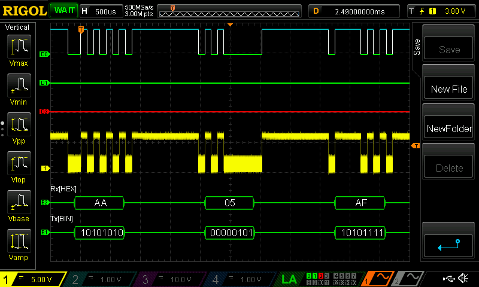
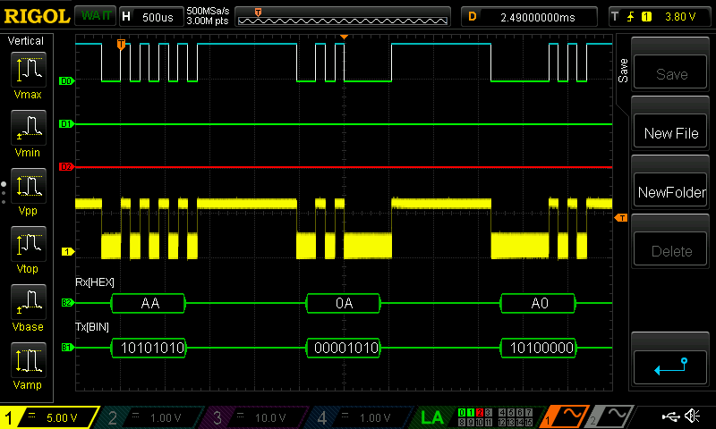
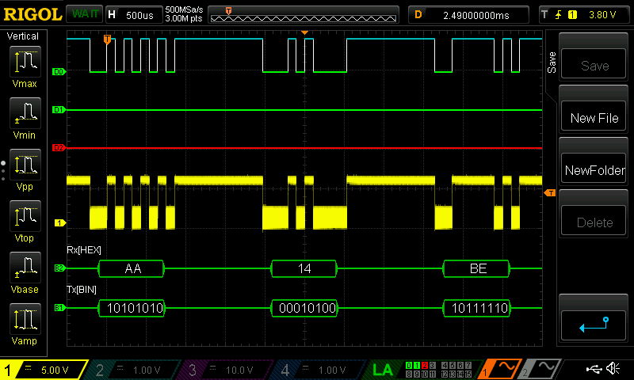
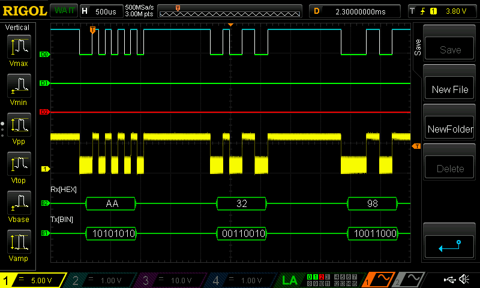
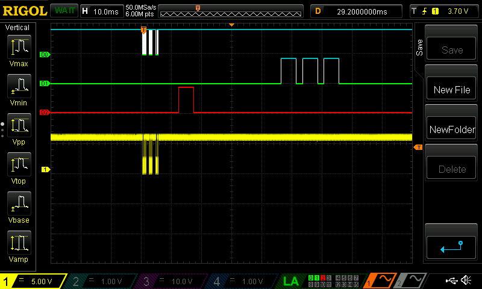

= Coin Acceptor (DG600F) demo with Arduino Uno

== Intro

Example for DG600F (S).

The sample configures 2 inputs and 3 outputs.

In the sample, only one input is used to reset the current balance: PIN 2

In the sample, PIN 6 and 7 are connected to LEDs.
PIN6 makes the LED blinks when a coin is detected.
PIN7 blinks when enough is paid.
PIN9 is illuminated when an error occurs.

 Signal for a 5 cents coin

 Signal for a 10 cents coin

 Signal for a 20 cents coin

 Signal for a 50 cents coin

 Signal + Coin detect + Action. On this trace, we see the signal (D0), followed by a 5ms pulse showing we detected a coin (D2), followed by 3 pulses on  D1, showing that we reached the minimum balance and used it to perform an action.
